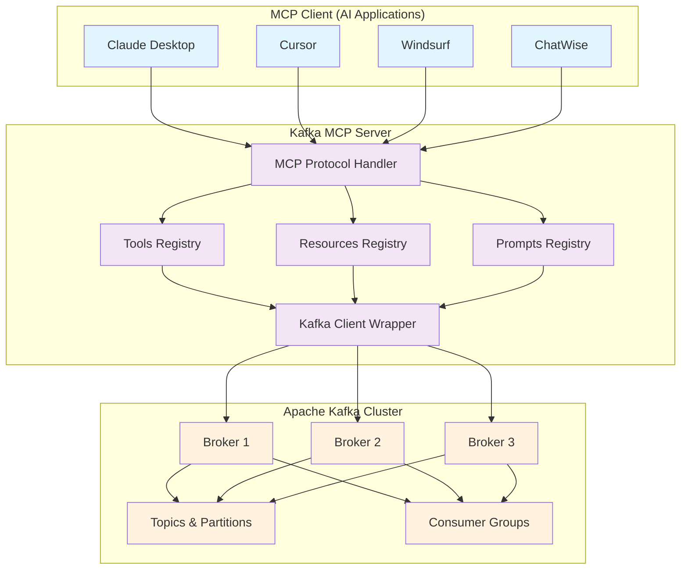

# Kafka MCP Server

A Model Context Protocol (MCP) server for Apache Kafka implemented in Go, leveraging [franz-go](https://github.com/twmb/franz-go) and [mcp-go](https://github.com/mark3labs/mcp-go).

This server provides an implementation for interacting with Kafka via the MCP protocol, enabling LLM models to perform common Kafka operations through a standardized interface.

[](https://goreportcard.com/report/github.com/tuannvm/kafka-mcp-server)
[](https://github.com/tuannvm/kafka-mcp-server/actions/workflows/build.yml)
[](https://github.com/tuannvm/kafka-mcp-server/blob/main/go.mod)
[](https://github.com/tuannvm/kafka-mcp-server/actions/workflows/build.yml)
[](https://slsa.dev)
[](https://pkg.go.dev/github.com/tuannvm/kafka-mcp-server)
[](https://github.com/tuannvm/kafka-mcp-server/pkgs/container/kafka-mcp-server)
[](https://github.com/tuannvm/kafka-mcp-server/releases/latest)
[](https://opensource.org/licenses/MIT)

## Overview

The Kafka MCP Server bridges the gap between LLM models and Apache Kafka, allowing them to:

- Produce and consume messages from topics
- List, describe, and manage topics
- Monitor and manage consumer groups
- Assess cluster health and configuration
- Execute standard Kafka operations

All through the standardized Model Context Protocol (MCP).

## Architecture



**How it works:**
1. **MCP Clients** (AI applications) connect to the Kafka MCP Server via stdio or HTTP transport
2. **MCP Server** exposes three types of capabilities:
   - **Tools** - Direct Kafka operations (produce/consume messages, describe topics, etc.)
   - **Resources** - Cluster health reports and diagnostics
   - **Prompts** - Pre-configured workflows for common operations
3. **Kafka Client Wrapper** handles all Kafka communication using the franz-go library
4. **Apache Kafka Cluster** processes the actual message streaming and storage

**Transport Modes:**
- **STDIO**: Default mode, ideal for local MCP clients (Claude Desktop, Cursor, etc.)
- **HTTP**: Enables remote access with optional OAuth 2.1 authentication


## Key Features

- **Kafka Integration**: Implementation of common Kafka operations via MCP
- **Security**:
  - Support for SASL (PLAIN, SCRAM-SHA-256, SCRAM-SHA-512) and TLS authentication
  - OAuth 2.1 authentication for HTTP transport (Native and Proxy modes)
  - Support for Okta, Google, Azure AD, and HMAC providers
- **Flexible Transport**: STDIO for local clients, HTTP for remote access
- **Error Handling**: Error handling with meaningful feedback
- **Configuration Options**: Customizable for different environments
- **Pre-Configured Prompts**: Set of prompts for common Kafka operations
- **Compatibility**: Works with MCP-compatible LLM models

## Getting Started

### Prerequisites

- Go 1.24 or later
- Docker (for running integration tests)
- Access to a Kafka cluster

### Installation

#### Homebrew (macOS and Linux)

The easiest way to install kafka-mcp-server is using Homebrew:

```bash
# Add the tap repository
brew tap tuannvm/mcp

# Install kafka-mcp-server
brew install kafka-mcp-server
```

To update to the latest version:

```bash
brew update && brew upgrade kafka-mcp-server
```

#### From Source

```bash
# Clone the repository
git clone https://github.com/tuannvm/kafka-mcp-server.git
cd kafka-mcp-server

# Build the server
go build -o kafka-mcp-server ./cmd
```

### MCP Client Integration

This MCP server can be integrated with several AI applications. Below are platform-specific instructions:

#### Cursor

Edit `~/.cursor/mcp.json` and add the kafka-mcp-server configuration:

```json
{
  "mcpServers": {
    "kafka": {
      "command": "kafka-mcp-server",
      "args": [],
      "env": {
        "KAFKA_BROKERS": "localhost:9092",
        "KAFKA_CLIENT_ID": "kafka-mcp-server",
        "MCP_TRANSPORT": "stdio"
      }
    }
  }
}
```

#### Claude Desktop

Edit your Claude configuration file and add the server:
- **macOS**: `~/Library/Application Support/Claude/claude_desktop_config.json`
- **Windows**: `%APPDATA%\Claude\claude_desktop_config.json`

```json
{
  "mcpServers": {
    "kafka": {
      "command": "kafka-mcp-server",
      "args": [],
      "env": {
        "KAFKA_BROKERS": "localhost:9092",
        "KAFKA_CLIENT_ID": "kafka-mcp-server",
        "MCP_TRANSPORT": "stdio"
      }
    }
  }
}
```

Restart Claude Desktop to apply changes.

#### Claude Code

To use with [Claude Code](https://claude.ai/code), add the server using the built-in MCP configuration command:

```bash
# Add kafka-mcp-server with environment variables
claude mcp add kafka \
  --env KAFKA_BROKERS=localhost:9092 \
  --env KAFKA_CLIENT_ID=kafka-mcp-server \
  --env MCP_TRANSPORT=stdio \
  --env KAFKA_SASL_MECHANISM= \
  --env KAFKA_SASL_USER= \
  --env KAFKA_SASL_PASSWORD= \
  --env KAFKA_TLS_ENABLE=false \
  -- kafka-mcp-server
```

**Other useful commands:**
```bash
# List configured MCP servers
claude mcp list

# Remove server
claude mcp remove kafka

# Test server connection
claude mcp get kafka
```

#### ChatWise

1. Open ChatWise → Settings → Tools → "+" → "Command Line MCP"
2. Configure:
   - **ID**: `kafka`
   - **Command**: `kafka-mcp-server`
   - **Args**: (leave empty)
   - **Env**: Add environment variables:
     ```
     KAFKA_BROKERS=localhost:9092
     KAFKA_CLIENT_ID=kafka-mcp-server
     MCP_TRANSPORT=stdio
     ```

## Simplify Configuration with mcpenetes

Managing MCP server configurations across multiple clients can become challenging. [mcpenetes](https://github.com/tuannvm/mcpenetes/) is a dedicated tool that makes this process significantly easier:

```bash
# Install mcpenetes
go install github.com/tuannvm/mcpenetes@latest
```

### Key Features

- **Interactive Search**: Find and select Kafka MCP server configurations with a simple command
- **Apply Everywhere**: Automatically sync configurations across all your MCP clients 
- **Configuration Backup**: Safely backup existing configurations before making changes
- **Restore**: Easily revert to previous configurations if needed

### Quick Start with mcpenetes

```bash
# Search for available MCP servers including kafka-mcp-server
mcpenetes search 

# Apply kafka-mcp-server configuration to all your clients at once
mcpenetes apply

# Load a configuration from your clipboard
mcpenetes load
```

With mcpenetes, you can maintain multiple Kafka configurations (development, production, etc.) and switch between them instantly across all your clients (Cursor, Claude Desktop, Windsurf, ChatWise) without manually editing each client's configuration files.

## MCP Tools

The server exposes the following tools for Kafka interaction. For detailed documentation including examples and sample responses, see [docs/tools.md](docs/tools.md).

- **produce_message**: Produces messages to Kafka topics
- **consume_messages**: Consumes messages from Kafka topics in batch operations
- **list_brokers**: Lists all configured Kafka broker addresses
- **describe_topic**: Provides comprehensive metadata for specific topics
- **list_consumer_groups**: Enumerates all consumer groups in the cluster
- **describe_consumer_group**: Provides detailed consumer group information including lag metrics
- **describe_configs**: Retrieves configuration settings for Kafka resources
- **cluster_overview**: Provides comprehensive cluster health summaries
- **list_topics**: Lists all topics with metadata including partition and replication information

## MCP Resources

The server provides the following resources that can be accessed through the MCP protocol. For detailed documentation including example responses, see [docs/resources.md](docs/resources.md).

- **kafka-mcp://overview**: Comprehensive cluster health summary
- **kafka-mcp://health-check**: Detailed health assessment with actionable insights
- **kafka-mcp://under-replicated-partitions**: Analysis of partitions with replication issues
- **kafka-mcp://consumer-lag-report**: Consumer performance analysis with customizable thresholds

## MCP Prompts

The server includes the following pre-configured prompts for Kafka operations and diagnostics. For detailed documentation including arguments and example responses, see [docs/prompts.md](docs/prompts.md).

- **kafka_cluster_overview**: Generates comprehensive cluster health summaries
- **kafka_health_check**: Performs detailed health assessments with actionable recommendations
- **kafka_under_replicated_partitions**: Analyzes replication issues with troubleshooting guidance
- **kafka_consumer_lag_report**: Provides consumer lag analysis with performance optimization recommendations

## End-to-End Example

Here's an interaction example showing how an AI assistant might use these tools to help a user:

**User Query:** "We need to investigate why our order processing pipeline is falling behind. Can you help me check the consumer lag?"

**AI Assistant's workflow:**

1. First, check the consumer groups
   ```
   > Using list_consumer_groups tool
   > Discovers "order-processor" group
   ```

2. Then, examine the consumer group details
   ```
   > Using describe_consumer_group tool with group_id "order-processor" and include_offsets=true
   > Discovers lag on several partitions
   ```

3. Get cluster overview to check general health
   ```
   > Using cluster_overview tool
   > Confirms no under-replicated partitions or offline brokers
   ```

4. Generate a consumer lag report
   ```
   > Using consumer_lag_report prompt with threshold=1000
   > Provides detailed analysis of lag across consumer groups
   ```

5. Provide actionable recommendations:
   ```
   Based on my analysis, your order-processor consumer group has significant lag on topic orders, partitions 2 and 3, with lag values of 15,420 and 12,305 messages respectively.

   The cluster itself is healthy with no under-replicated partitions, suggesting this is an issue with the consumer application rather than Kafka infrastructure.

   I recommend:
   1. Check the consumer instances processing those partitions for slowdowns or errors
   2. Consider scaling up your consumer group by adding more instances
   3. Review the consumer configuration, particularly max.poll.records and max.poll.interval.ms
   4. Examine any processing bottlenecks in the consumer logic
   ```

This seamless workflow demonstrates how the Kafka MCP tools enable LLM models to perform sophisticated diagnostics and provide actionable insights.

## Configuration

The server can be configured using the following environment variables:

| Variable | Description | Default |
| :------- | :---------- | :------ |
| `KAFKA_BROKERS` | Comma-separated list of Kafka broker addresses | `localhost:9092` |
| `KAFKA_CLIENT_ID` | Kafka client ID used for connections | `kafka-mcp-server` |
| `MCP_TRANSPORT` | MCP transport method (stdio/http) | `stdio` |
| `KAFKA_SASL_MECHANISM` | SASL mechanism: `plain`, `scram-sha-256`, `scram-sha-512`, or `""` (disabled) | `""` |
| `KAFKA_SASL_USER` | Username for SASL authentication | `""` |
| `KAFKA_SASL_PASSWORD` | Password for SASL authentication | `""` |
| `KAFKA_TLS_ENABLE` | Enable TLS for Kafka connection (`true` or `false`) | `false` |
| `KAFKA_TLS_INSECURE_SKIP_VERIFY` | Skip TLS certificate verification (`true` or `false`) | `false` |

### OAuth 2.1 Configuration (HTTP Transport Only)

When using HTTP transport (`MCP_TRANSPORT=http`), OAuth 2.1 authentication can be enabled:

| Variable | Description | Default | Required |
| :------- | :---------- | :------ | :------- |
| `MCP_HTTP_PORT` | HTTP server port | `8080` | No |
| `OAUTH_ENABLED` | Enable OAuth 2.1 authentication | `false` | No |
| `OAUTH_MODE` | OAuth mode: `native` or `proxy` | `native` | No |
| `OAUTH_PROVIDER` | Provider: `hmac`, `okta`, `google`, `azure` | `okta` | No |
| `OAUTH_SERVER_URL` | Full MCP server URL (e.g., `https://localhost:8080`) | - | When OAuth enabled |
| `OIDC_ISSUER` | OAuth issuer URL | - | When OAuth enabled |
| `OIDC_AUDIENCE` | OAuth audience | - | When OAuth enabled |
| `OIDC_CLIENT_ID` | OAuth client ID | - | Proxy mode only |
| `OIDC_CLIENT_SECRET` | OAuth client secret | - | Proxy mode only |
| `OAUTH_REDIRECT_URIS` | Comma-separated redirect URIs | - | Proxy mode only |
| `JWT_SECRET` | JWT signing secret | - | Proxy mode only |

**For detailed OAuth setup and examples, see [docs/oauth.md](docs/oauth.md).**

> **Security Notes:**
> - When using `KAFKA_TLS_INSECURE_SKIP_VERIFY=true`, the server will skip TLS certificate verification. This should only be used in development or testing environments, or when using self-signed certificates.
> - OAuth is only available when using HTTP transport. STDIO transport does not support OAuth.
> - Always use HTTPS in production when OAuth is enabled.

## Security Considerations

The server is designed with enterprise-grade security in mind:

- **Authentication**:
  - Kafka: Full support for SASL PLAIN, SCRAM-SHA-256, and SCRAM-SHA-512
  - MCP Server: OAuth 2.1 authentication for HTTP transport (Okta, Google, Azure AD, HMAC)
- **Encryption**: TLS support for secure communication with Kafka brokers
- **Input Validation**: Thorough validation of all user inputs to prevent injection attacks
- **Error Handling**: Secure error handling that doesn't expose sensitive information
- **Token Security**: Bearer token validation with 5-minute caching for OAuth-protected endpoints

For OAuth security best practices, see [docs/oauth.md](docs/oauth.md).

## Development

### Testing

Comprehensive test coverage ensures reliability:

```bash
# Run all tests (requires Docker for integration tests)
go test ./...

# Run tests excluding integration tests
go test -short ./...

# Run integration tests with specific Kafka brokers
export KAFKA_BROKERS="your-broker:9092"
export SKIP_KAFKA_TESTS="false"
go test ./kafka -v -run Test
```

### Contributing

Contributions are welcome! Please feel free to submit a Pull Request.

## License

This project is licensed under the MIT License - see the LICENSE file for details.
