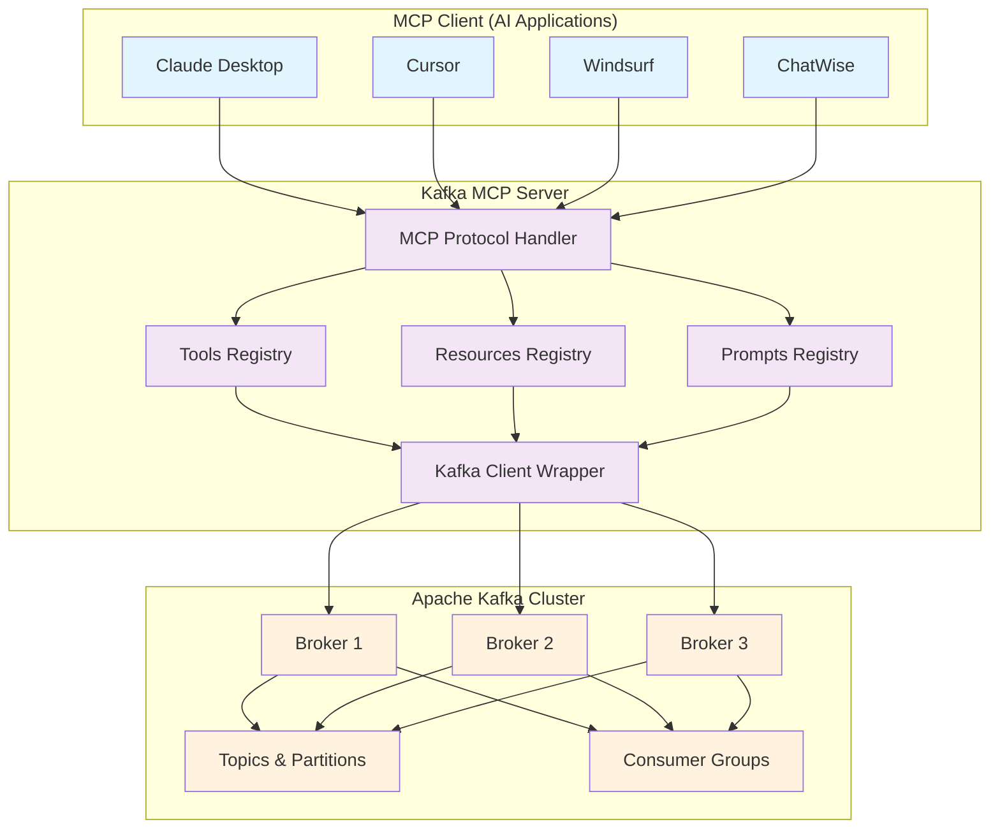

# Kafka MCP Server

A Model Context Protocol (MCP) server for Apache Kafka implemented in Go, leveraging [franz-go](https://github.com/twmb/franz-go) and [mcp-go](https://github.com/mark3labs/mcp-go).

This server provides an implementation for interacting with Kafka via the MCP protocol, enabling LLM models to perform common Kafka operations through a standardized interface.

[](https://goreportcard.com/report/github.com/tuannvm/kafka-mcp-server)
[](https://github.com/tuannvm/kafka-mcp-server/actions/workflows/build.yml)
[](https://github.com/tuannvm/kafka-mcp-server/blob/main/go.mod)
[](https://github.com/tuannvm/kafka-mcp-server/actions/workflows/build.yml)
[](https://slsa.dev)
[](https://pkg.go.dev/github.com/tuannvm/kafka-mcp-server)
[](https://github.com/tuannvm/kafka-mcp-server/pkgs/container/kafka-mcp-server)
[](https://github.com/tuannvm/kafka-mcp-server/releases/latest)
[](https://opensource.org/licenses/MIT)

## Overview

The Kafka MCP Server bridges the gap between LLM models and Apache Kafka, allowing them to:

- Produce and consume messages from topics
- List, describe, and manage topics
- Monitor and manage consumer groups
- Assess cluster health and configuration
- Execute standard Kafka operations

All through the standardized Model Context Protocol (MCP).

## Architecture



**How it works:**
1. **MCP Clients** (AI applications) connect to the Kafka MCP Server via stdio transport
2. **MCP Server** exposes three types of capabilities:
   - **Tools** - Direct Kafka operations (produce/consume messages, describe topics, etc.)
   - **Resources** - Cluster health reports and diagnostics
   - **Prompts** - Pre-configured workflows for common operations
3. **Kafka Client Wrapper** handles all Kafka communication using the franz-go library
4. **Apache Kafka Cluster** processes the actual message streaming and storage


## Key Features

- **Kafka Integration**: Implementation of common Kafka operations via MCP
- **Security**: Support for SASL (PLAIN, SCRAM-SHA-256, SCRAM-SHA-512) and TLS authentication
- **Error Handling**: Error handling with meaningful feedback
- **Configuration Options**: Customizable for different environments
- **Pre-Configured Prompts**: Set of prompts for common Kafka operations
- **Compatibility**: Works with MCP-compatible LLM models

## Getting Started

### Prerequisites

- Go 1.24 or later
- Docker (for running integration tests)
- Access to a Kafka cluster

### Installation

#### Homebrew (macOS and Linux)

The easiest way to install kafka-mcp-server is using Homebrew:

```bash
# Add the tap repository
brew tap tuannvm/mcp

# Install kafka-mcp-server
brew install kafka-mcp-server
```

To update to the latest version:

```bash
brew update && brew upgrade kafka-mcp-server
```

#### From Source

```bash
# Clone the repository
git clone https://github.com/tuannvm/kafka-mcp-server.git
cd kafka-mcp-server

# Build the server
go build -o kafka-mcp-server ./cmd
```

### MCP Client Integration

This MCP server can be integrated with several AI applications:

#### Basic Configuration

To integrate with MCP-compatible clients, add this configuration to your client's settings:

```json
{
  "mcpServers": {
    "kafka": {
      "command": "kafka-mcp-server",
      "env": {
        "KAFKA_BROKERS": "localhost:9092",
        "KAFKA_CLIENT_ID": "kafka-mcp-server",
        "MCP_TRANSPORT": "stdio",
        "KAFKA_SASL_MECHANISM": "",
        "KAFKA_SASL_USER": "",
        "KAFKA_SASL_PASSWORD": "",
        "KAFKA_TLS_ENABLE": "false",
        "KAFKA_TLS_INSECURE_SKIP_VERIFY": "false"
      }
    }
  }
}
```

For secured environments:

```json
{
  "mcpServers": {
    "kafka": {
      "command": "kafka-mcp-server",
      "env": {
        "KAFKA_BROKERS": "kafka-broker-1:9092,kafka-broker-2:9092",
        "KAFKA_CLIENT_ID": "kafka-mcp-server",
        "MCP_TRANSPORT": "stdio",
        "KAFKA_SASL_MECHANISM": "scram-sha-512",
        "KAFKA_SASL_USER": "kafka-user",
        "KAFKA_SASL_PASSWORD": "kafka-password",
        "KAFKA_TLS_ENABLE": "true",
        "KAFKA_TLS_INSECURE_SKIP_VERIFY": "false"
      }
    }
  }
}
```

#### Using Docker Image

To use the Docker image instead of a local binary:

```json
{
  "mcpServers": {
    "kafka": {
      "command": "docker",
      "args": [
        "run", 
        "--rm", 
        "-i", 
        "-e", "KAFKA_BROKERS=kafka-broker:9092", 
        "-e", "KAFKA_CLIENT_ID=kafka-mcp-server",
        "-e", "MCP_TRANSPORT=stdio",
        "-e", "KAFKA_SASL_MECHANISM=", 
        "-e", "KAFKA_SASL_USER=", 
        "-e", "KAFKA_SASL_PASSWORD=", 
        "-e", "KAFKA_TLS_ENABLE=false",
        "ghcr.io/tuannvm/kafka-mcp-server:latest"
      ],
      "env": {}
    }
  }
}
```

> **Note**: If connecting to Kafka running on your host machine from Docker, use `host.docker.internal` as the broker address on macOS and Windows. For Linux, use `--network=host` in your Docker run command or the host's actual IP address.

#### Cursor

To use with [Cursor](https://cursor.sh/), create or edit `~/.cursor/mcp.json`:

```json
{
  "mcpServers": {
    "kafka": {
      "command": "kafka-mcp-server",
      "args": [],
      "env": {
        "KAFKA_BROKERS": "localhost:9092",
        "KAFKA_CLIENT_ID": "kafka-mcp-server",
        "MCP_TRANSPORT": "stdio",
        "KAFKA_SASL_MECHANISM": "",
        "KAFKA_SASL_USER": "",
        "KAFKA_SASL_PASSWORD": "",
        "KAFKA_TLS_ENABLE": "false"
      }
    }
  }
}
```

For HTTP+SSE transport mode (if supported):

```json
{
  "mcpServers": {
    "kafka-http": {
      "url": "http://localhost:9097/sse"
    }
  }
}
```

Then start the server in a separate terminal with:

```bash
MCP_TRANSPORT=http KAFKA_BROKERS=localhost:9092 kafka-mcp-server
```

#### Claude Desktop

To use with [Claude Desktop](https://claude.ai/desktop), edit your Claude configuration file:
- macOS: `~/Library/Application Support/Claude/claude_desktop_config.json`
- Windows: `%APPDATA%\Claude\claude_desktop_config.json`

```json
{
  "mcpServers": {
    "kafka": {
      "command": "kafka-mcp-server",
      "args": [],
      "env": {
        "KAFKA_BROKERS": "localhost:9092",
        "KAFKA_CLIENT_ID": "kafka-mcp-server",
        "MCP_TRANSPORT": "stdio",
        "KAFKA_SASL_MECHANISM": "",
        "KAFKA_SASL_USER": "",
        "KAFKA_SASL_PASSWORD": "",
        "KAFKA_TLS_ENABLE": "false"
      }
    }
  }
}
```

After updating the configuration, restart Claude Desktop. You should see the Kafka MCP tools available in the tools menu.

#### Windsurf

To use with [Windsurf](https://windsurf.com/refer?referral_code=sjqdvqozgx2wyi7r), create or edit your `mcp_config.json`:

```json
{
  "mcpServers": {
    "kafka": {
      "command": "kafka-mcp-server",
      "args": [],
      "env": {
        "KAFKA_BROKERS": "localhost:9092",
        "KAFKA_CLIENT_ID": "kafka-mcp-server",
        "MCP_TRANSPORT": "stdio",
        "KAFKA_SASL_MECHANISM": "",
        "KAFKA_SASL_USER": "",
        "KAFKA_SASL_PASSWORD": "",
        "KAFKA_TLS_ENABLE": "false"
      }
    }
  }
}
```

Restart Windsurf to apply the changes. The Kafka MCP tools will be available to the AI assistant.

#### ChatWise

To use with [ChatWise](https://chatwise.app?atp=uo1wzc), follow these steps:

1. Open ChatWise and go to Settings
2. Navigate to the Tools section
3. Click the "+" icon to add a new tool
4. Select "Command Line MCP"
5. Configure with the following details:
   - ID: `kafka` (or any name you prefer)
   - Command: `kafka-mcp-server`
   - Args: (leave empty)
   - Env: Add the following environment variables:
     ```
     KAFKA_BROKERS=localhost:9092
     KAFKA_CLIENT_ID=kafka-mcp-server
     MCP_TRANSPORT=stdio
     KAFKA_SASL_MECHANISM=
     KAFKA_SASL_USER=
     KAFKA_SASL_PASSWORD=
     KAFKA_TLS_ENABLE=false
     ```

Alternatively, you can import the configuration using the import option.

## Simplify Configuration with mcpenetes

Managing MCP server configurations across multiple clients can become challenging. [mcpenetes](https://github.com/tuannvm/mcpenetes/) is a dedicated tool that makes this process significantly easier:

```bash
# Install mcpenetes
go install github.com/tuannvm/mcpenetes@latest
```

### Key Features

- **Interactive Search**: Find and select Kafka MCP server configurations with a simple command
- **Apply Everywhere**: Automatically sync configurations across all your MCP clients 
- **Configuration Backup**: Safely backup existing configurations before making changes
- **Restore**: Easily revert to previous configurations if needed

### Quick Start with mcpenetes

```bash
# Search for available MCP servers including kafka-mcp-server
mcpenetes search 

# Apply kafka-mcp-server configuration to all your clients at once
mcpenetes apply

# Load a configuration from your clipboard
mcpenetes load
```

With mcpenetes, you can maintain multiple Kafka configurations (development, production, etc.) and switch between them instantly across all your clients (Cursor, Claude Desktop, Windsurf, ChatWise) without manually editing each client's configuration files.

## MCP Tools

The server exposes tools for Kafka interaction:

### produce_message

Produces a single message to a Kafka topic with optional key.

**Sample Prompt:**
> "Send a new order update to the orders topic with order ID 12345."

**Example:**
```json
{
  "topic": "orders",
  "key": "12345",
  "value": "{\"order_id\":\"12345\",\"status\":\"shipped\"}"
}
```

**Response:**
```json
"Message produced successfully to topic orders"
```

### consume_messages

Consumes a batch of messages from one or more Kafka topics.

**Sample Prompt:**
> "Retrieve the latest messages from the customer-events topic so I can see recent customer activity."

**Example:**
```json
{
  "topics": ["customer-events"],
  "max_messages": 5
}
```

**Response:**
```json
[
  {
    "topic": "customer-events",
    "partition": 0,
    "offset": 1042,
    "timestamp": 1650123456789,
    "key": "customer-123",
    "value": "{\"customer_id\":\"123\",\"action\":\"login\",\"timestamp\":\"2023-04-16T12:34:56Z\"}"
  },
  // Additional messages...
]
```

### list_brokers

Lists the configured Kafka broker addresses the server is connected to.

**Sample Prompt:**
> "What Kafka brokers do we have available in our cluster?"

**Example:**
```json
{}
```

**Response:**
```json
[
  "kafka-broker-1:9092",
  "kafka-broker-2:9092",
  "kafka-broker-3:9092"
]
```

### describe_topic

Provides detailed metadata for a specific Kafka topic.

**Sample Prompt:**
> "Show me the configuration and partition details for our orders topic."

**Example:**
```json
{
  "topic_name": "orders"
}
```

**Response:**
```json
{
  "name": "orders",
  "partitions": [
    {
      "partitionID": 0,
      "leader": 1,
      "replicas": [1, 2, 3],
      "ISR": [1, 2, 3],
      "errorCode": 0
    },
    {
      "partitionID": 1,
      "leader": 2,
      "replicas": [2, 3, 1],
      "ISR": [2, 3, 1],
      "errorCode": 0
    }
  ],
  "isInternal": false
}
```

### list_consumer_groups

Enumerates active consumer groups known by the Kafka cluster.

**Sample Prompt:**
> "What consumer groups are currently active in our Kafka cluster?"

**Example:**
```json
{}
```

**Response:**
```json
[
  {
    "groupID": "order-processor",
    "state": "Stable",
    "errorCode": 0
  },
  {
    "groupID": "analytics-pipeline",
    "state": "Stable",
    "errorCode": 0
  }
]
```

### describe_consumer_group

Shows details for a specific consumer group, including state, members, and partition offsets.

**Sample Prompt:**
> "Tell me about the order-processor consumer group. Are there any lagging consumers?"

**Example:**
```json
{
  "group_id": "order-processor",
  "include_offsets": true
}
```

**Response:**
```json
{
  "groupID": "order-processor",
  "state": "Stable",
  "members": [
    {
      "memberID": "consumer-1-uuid",
      "clientID": "consumer-1",
      "clientHost": "10.0.0.101",
      "assignments": [
        {"topic": "orders", "partitions": [0, 2, 4]}
      ]
    },
    {
      "memberID": "consumer-2-uuid",
      "clientID": "consumer-2",
      "clientHost": "10.0.0.102",
      "assignments": [
        {"topic": "orders", "partitions": [1, 3, 5]}
      ]
    }
  ],
  "offsets": [
    {
      "topic": "orders",
      "partition": 0,
      "commitOffset": 10045,
      "lag": 5
    },
    // More partitions...
  ],
  "errorCode": 0
}
```

### describe_configs

Fetches configuration entries for a specific resource (topic or broker).

**Sample Prompt:**
> "What's the retention configuration for our clickstream topic?"

**Example:**
```json
{
  "resource_type": "topic",
  "resource_name": "clickstream",
  "config_keys": ["retention.ms", "retention.bytes"]
}
```

**Response:**
```json
{
  "configs": [
    {
      "name": "retention.ms",
      "value": "604800000",
      "source": "DYNAMIC_TOPIC_CONFIG",
      "isSensitive": false,
      "isReadOnly": false
    },
    {
      "name": "retention.bytes",
      "value": "1073741824",
      "source": "DYNAMIC_TOPIC_CONFIG",
      "isSensitive": false,
      "isReadOnly": false
    }
  ]
}
```

### cluster_overview

Aggregates high-level cluster health data, including controller, brokers, topics, and partition status.

**Sample Prompt:**
> "Give me an overview of our Kafka cluster health."

**Example:**
```json
{}
```

**Response:**
```json
{
  "brokerCount": 3,
  "controllerID": 1,
  "topicCount": 24,
  "partitionCount": 120,
  "underReplicatedPartitionsCount": 0,
  "offlinePartitionsCount": 0,
  "offlineBrokerIDs": []
}
```

## MCP Resources

The server provides the following resources that can be accessed through the MCP protocol:

### kafka-mcp://{cluster}/overview

Provides a summary of Kafka cluster health and metrics.

**Example Response:**
```json
{
  "timestamp": "2023-08-15T12:34:56Z",
  "broker_count": 3,
  "controller_id": 1,
  "topic_count": 24,
  "partition_count": 120,
  "under_replicated_partitions": 0,
  "offline_partitions": 0,
  "offline_broker_ids": [],
  "health_status": "healthy"
}
```

### kafka-mcp://{cluster}/health-check

Performs a comprehensive health assessment of the Kafka cluster.

**Example Response:**
```json
{
  "timestamp": "2023-08-15T12:34:56Z",
  "broker_status": {
    "total_brokers": 3,
    "offline_brokers": 0,
    "offline_broker_ids": [],
    "status": "healthy"
  },
  "controller_status": {
    "controller_id": 1,
    "status": "healthy"
  },
  "partition_status": {
    "total_partitions": 120,
    "under_replicated_partitions": 0,
    "offline_partitions": 0,
    "status": "healthy"
  },
  "consumer_status": {
    "total_groups": 5,
    "groups_with_high_lag": 0,
    "status": "healthy",
    "error": ""
  },
  "overall_status": "healthy"
}
```

### kafka-mcp://{cluster}/under-replicated-partitions

Provides a detailed report of under-replicated partitions in the cluster.

**Example Response:**
```json
{
  "timestamp": "2023-08-15T12:34:56Z",
  "under_replicated_partition_count": 2,
  "details": [
    {
      "topic": "orders",
      "partition": 3,
      "leader": 1,
      "replica_count": 3,
      "isr_count": 2,
      "replicas": [1, 2, 3],
      "isr": [1, 2],
      "missing_replicas": [3]
    },
    {
      "topic": "clickstream",
      "partition": 5,
      "leader": 2,
      "replica_count": 3,
      "isr_count": 2,
      "replicas": [2, 3, 1],
      "isr": [2, 1],
      "missing_replicas": [3]
    }
  ],
  "recommendations": [
    "Check broker health for any offline or struggling brokers",
    "Verify network connectivity between brokers",
    "Monitor disk space on broker nodes",
    "Review broker logs for detailed error messages",
    "Consider increasing replication timeouts if network is slow"
  ]
}
```

### kafka-mcp://{cluster}/consumer-lag-report

Analyzes consumer group lag across the cluster. Accepts an optional "threshold" query parameter to set the lag threshold.

**Example Response:**
```json
{
  "timestamp": "2023-08-15T12:34:56Z",
  "lag_threshold": 1000,
  "group_count": 3,
  "group_summary": [
    {
      "group_id": "order-processor",
      "state": "Stable",
      "member_count": 2,
      "topic_count": 1,
      "total_lag": 15420,
      "has_high_lag": true
    },
    {
      "group_id": "analytics-pipeline",
      "state": "Stable",
      "member_count": 3,
      "topic_count": 2,
      "total_lag": 520,
      "has_high_lag": false
    }
  ],
  "high_lag_details": [
    {
      "group_id": "order-processor",
      "topic": "orders",
      "partition": 2,
      "current_offset": 1045822,
      "log_end_offset": 1061242,
      "lag": 15420
    }
  ],
  "recommendations": [
    "Check consumer instances for errors or slowdowns",
    "Consider scaling up consumer groups with high lag",
    "Review consumer configuration settings",
    "Examine processing bottlenecks in consumer application logic"
  ]
}
```

## MCP Prompts

The server includes the following pre-configured prompts for Kafka operations and diagnostics:

### kafka_cluster_overview

Provides a summary of Kafka cluster health and metrics.

**Arguments:**
- `cluster` (required): The Kafka cluster name

**Example Response:**
```
# Kafka Cluster Overview

**Time**: 2023-08-15T12:34:56Z

- **Broker Count**: 3
- **Active Controller ID**: 1
- **Total Topics**: 24
- **Total Partitions**: 120
- **Under-Replicated Partitions**: 0
- **Offline Partitions**: 0

**Overall Status**: ✅ Healthy
```

### kafka_health_check

Runs a comprehensive health check on the Kafka cluster.

**Arguments:**
- `cluster` (required): The Kafka cluster name

**Example Response:**
```
# Kafka Cluster Health Check Report

**Time**: 2023-08-15T12:34:56Z

## Broker Status

- ✅ **All 3 brokers are online**

## Controller Status

- ✅ **Active controller**: Broker 1

## Partition Health

- ✅ **All 120 partitions are online**
- ✅ **No under-replicated partitions detected**

## Consumer Group Health

- ✅ **5 consumer groups are active**
- ✅ **No consumer groups with significant lag detected**

## Overall Health Assessment

✅ **HEALTHY**: All systems are operating normally.
```

### kafka_under_replicated_partitions

Lists topics and partitions where ISR count is less than replication factor.

**Arguments:**
- `cluster` (required): The Kafka cluster name

**Example Response:**
```
# Under-Replicated Partitions Report

**Time**: 2023-08-15T12:34:56Z

⚠️ **Found 2 under-replicated partitions**

| Topic | Partition | Leader | Replica Count | ISR Count | Missing Replicas |
|:------|----------:|-------:|--------------:|----------:|:-----------------|
| orders | 3 | 1 | 3 | 2 | 3 |
| clickstream | 5 | 2 | 3 | 2 | 3 |

## Possible Causes

Under-replicated partitions occur when one or more replicas are not in sync with the leader. Common causes include:

- **Broker failure or network partition**
- **High load on brokers**
- **Insufficient disk space**
- **Network bandwidth limitations**
- **Misconfigured topic replication factor**

## Recommendations

1. **Check broker health** for any offline or struggling brokers
2. **Verify network connectivity** between brokers
3. **Monitor disk space** on broker nodes
4. **Review broker logs** for detailed error messages
5. **Consider increasing replication timeouts** if network is slow
```

### kafka_consumer_lag_report

Provides a detailed report on consumer lag across all consumer groups.

**Arguments:**
- `cluster` (required): The Kafka cluster name
- `threshold` (optional): Lag threshold for highlighting high lag (default: 1000)

**Example Response:**
```
# Kafka Consumer Lag Report

**Time**: 2023-08-15T12:34:56Z

**Lag Threshold**: 1000 messages

Found 3 consumer group(s)

## Consumer Group Summary

| Group ID | State | Members | Topics | Total Lag | High Lag |
|:---------|:------|--------:|-------:|----------:|:---------|
| order-processor | Stable | 2 | 1 | 15,420 | ⚠️ Yes |
| analytics-pipeline | Stable | 3 | 2 | 520 | No |
| monitoring | Stable | 1 | 3 | 0 | No |

## High Lag Details

### Group: order-processor

| Topic | Partition | Current Offset | Log End Offset | Lag |
|:------|----------:|--------------:|--------------:|----:|
| orders | 2 | 1,045,822 | 1,061,242 | 15,420 |

## Recommendations

1. **Check consumer instances** for errors or slowdowns
2. **Scale up consumer groups** with high lag
3. **Review consumer configuration** settings
4. **Examine processing bottlenecks** in consumer application logic
```

## End-to-End Example

Here's an interaction example showing how an AI assistant might use these tools to help a user:

**User Query:** "We need to investigate why our order processing pipeline is falling behind. Can you help me check the consumer lag?"

**AI Assistant's workflow:**

1. First, check the consumer groups
   ```
   > Using list_consumer_groups tool
   > Discovers "order-processor" group
   ```

2. Then, examine the consumer group details
   ```
   > Using describe_consumer_group tool with group_id "order-processor" and include_offsets=true
   > Discovers lag on several partitions
   ```

3. Get cluster overview to check general health
   ```
   > Using cluster_overview tool
   > Confirms no under-replicated partitions or offline brokers
   ```

4. Generate a consumer lag report
   ```
   > Using consumer_lag_report prompt with threshold=1000
   > Provides detailed analysis of lag across consumer groups
   ```

5. Provide actionable recommendations:
   ```
   Based on my analysis, your order-processor consumer group has significant lag on topic orders, partitions 2 and 3, with lag values of 15,420 and 12,305 messages respectively.

   The cluster itself is healthy with no under-replicated partitions, suggesting this is an issue with the consumer application rather than Kafka infrastructure.

   I recommend:
   1. Check the consumer instances processing those partitions for slowdowns or errors
   2. Consider scaling up your consumer group by adding more instances
   3. Review the consumer configuration, particularly max.poll.records and max.poll.interval.ms
   4. Examine any processing bottlenecks in the consumer logic
   ```

This seamless workflow demonstrates how the Kafka MCP tools enable LLM models to perform sophisticated diagnostics and provide actionable insights.

## Configuration

The server can be configured using the following environment variables:

| Variable | Description | Default |
| :------- | :---------- | :------ |
| `KAFKA_BROKERS` | Comma-separated list of Kafka broker addresses | `localhost:9092` |
| `KAFKA_CLIENT_ID` | Kafka client ID used for connections | `kafka-mcp-server` |
| `MCP_TRANSPORT` | MCP transport method (stdio/http) | `stdio` |
| `KAFKA_SASL_MECHANISM` | SASL mechanism: `plain`, `scram-sha-256`, `scram-sha-512`, or `""` (disabled) | `""` |
| `KAFKA_SASL_USER` | Username for SASL authentication | `""` |
| `KAFKA_SASL_PASSWORD` | Password for SASL authentication | `""` |
| `KAFKA_TLS_ENABLE` | Enable TLS for Kafka connection (`true` or `false`) | `false` |
| `KAFKA_TLS_INSECURE_SKIP_VERIFY` | Skip TLS certificate verification (`true` or `false`) | `false` |

> **Security Note:** When using `KAFKA_TLS_INSECURE_SKIP_VERIFY=true`, the server will skip TLS certificate verification. This should only be used in development or testing environments, or when using self-signed certificates.

## Security Considerations

The server is designed with enterprise-grade security in mind:

- **Authentication**: Full support for SASL PLAIN, SCRAM-SHA-256, and SCRAM-SHA-512
- **Encryption**: TLS support for secure communication with Kafka brokers
- **Input Validation**: Thorough validation of all user inputs to prevent injection attacks
- **Error Handling**: Secure error handling that doesn't expose sensitive information

## Development

### Testing

Comprehensive test coverage ensures reliability:

```bash
# Run all tests (requires Docker for integration tests)
go test ./...

# Run tests excluding integration tests
go test -short ./...

# Run integration tests with specific Kafka brokers
export KAFKA_BROKERS="your-broker:9092"
export SKIP_KAFKA_TESTS="false"
go test ./kafka -v -run Test
```

### Contributing

Contributions are welcome! Please feel free to submit a Pull Request.

## License

This project is licensed under the MIT License - see the LICENSE file for details.
